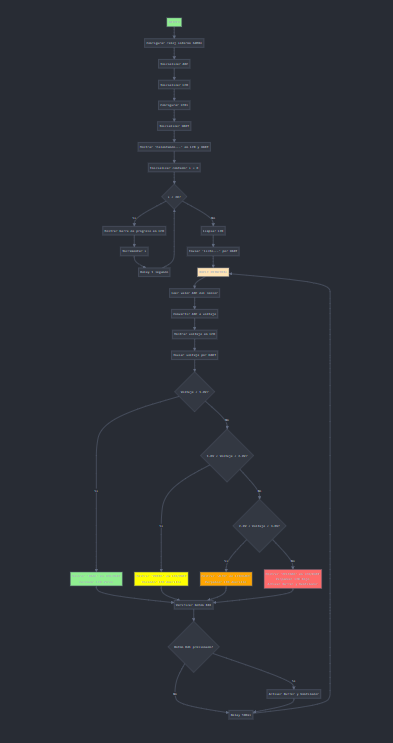

# Proyecto final

## Integrantes

Sergio Caicedo

Jhon Franco

David SIerra

## Nombre del proyecto: 

### ALARMA DE GASES

## Documentación

1. Introducción
Este proyecto implementa un sistema de detección y monitoreo de niveles de alcohol en el aire utilizando el sensor MQ-3. La información captada se procesa con un microcontrolador PIC18F y se visualiza en una pantalla LCD. Además, se activan indicadores visuales (LEDs) y un ventilador según el nivel de concentración detectado, y se transmite la lectura por UART.

2. Objetivo
Diseñar e implementar un sistema embebido capaz de:

Leer datos analógicos desde un sensor MQ-3.

Convertir y visualizar los datos en formato de voltaje.

Determinar el nivel de concentración según umbrales definidos.

Activar señales visuales y un actuador en función del nivel.

Enviar los datos a través del puerto serial (UART) para monitoreo externo.

3. Componentes del Sistema
Sensor MQ-3: Sensor analógico de detección de alcohol.

Microcontrolador: PIC18F con oscilador interno a 64 MHz.

LCD: Display de 16x2 en modo de 4 bits.

LEDs: Indicadores de nivel (Verde, Amarillo, Rojo).

Ventilador y Buffer: Activados en estado de peligro.

UART: Comunicación serial con PC.

Potenciómetro: Para simulación de entrada analógica.

Botón: Activación manual de ventilador y buffer.

4. Arquitectura del Sistema
4.1 Flujo General
Calentamiento del sensor MQ-3 (20 segundos).

Lectura continua del valor analógico del sensor.

Conversión del valor a voltaje.

Visualización del voltaje y nivel en el LCD.

Activación de LEDs y ventilador según umbrales.

Transmisión de datos por UART.

4.2 Umbrales Definidos

BAJO: < 1.0V

MEDIO: 1.0V – 2.0V

ALTO: 2.0V – 3.0V

PELIGRO: ≥ 3.0V

5. Archivos y Funcionalidad

main.c
Inicializa el sistema y controla el flujo principal.

Realiza la lectura, procesamiento y visualización de datos.

ADC.c / ADC.h
Configura el módulo ADC.

Realiza la conversión analógica-digital.

LCD.c / LCD.h
Controla la pantalla LCD en modo de 4 bits.

Muestra texto, números, y crea caracteres personalizados.

INDICADORES.c / INDICADORES.h
Controla los LEDs según niveles de voltaje.

Activa el ventilador y buffer en nivel peligroso o mediante botón.

UART.c / UART.h
Configura UART a 9600 bps.

Envía texto, números y voltajes al puerto serial.

6. Hardware Utilizado

PIC18F45K22

Sensor MQ-3

Display LCD 16x2

LEDs (x3)

Ventilador 5V

Potenciómetro (10k)

Resistencias, cables, protoboard

7. Resultados Esperados

Se visualiza en el LCD el voltaje del sensor y el nivel correspondiente.

Se encienden LEDs según el nivel detectado.

En el caso de nivel “PELIGRO”, se activan el LED rojo, el buffer y el ventilador.

Se imprime el voltaje y el nivel vía UART en un monitor serial.

## Diagramas

### Diagrama ed Flujo

## Conclusiones

Integración exitosa de hardware y software:
El proyecto demostró una integración efectiva entre sensores analógicos, elementos de visualización (LCD), actuadores (ventilador), indicadores (LEDs) y comunicación serial, todos controlados por un microcontrolador PIC18F.

Aplicación práctica del sensor MQ-3:
El uso del sensor MQ-3 permitió detectar concentraciones de alcohol de manera eficiente, mostrando cómo un sistema de sensores puede ser aplicado en contextos reales como pruebas de aliento o sistemas de seguridad.

Visualización clara y en tiempo real:
La implementación del LCD facilitó la lectura inmediata del voltaje medido y el estado del nivel de alcohol, mejorando la usabilidad del sistema.

Respuesta automatizada y segura:
El control automático de los LEDs y el ventilador según umbrales definidos permitió una respuesta rápida del sistema ante niveles peligrosos, lo cual es esencial para aplicaciones de seguridad.

Ampliación del conocimiento en microcontroladores:
Este proyecto permitió reforzar habilidades en programación de periféricos del PIC (ADC, UART, LCD, E/S digitales) y en diseño de sistemas embebidos.

Comunicación efectiva con el exterior:
La transmisión serial por UART proporcionó una herramienta útil para monitorear y registrar los datos, lo cual es fundamental en proyectos donde se requiere análisis posterior o supervisión remota.

Plataforma escalable:
El diseño modular del código y la estructura del sistema permiten futuras mejoras, como agregar sensores adicionales, conexión Bluetooth o almacenamiento de datos.

<!-- Crear una carpeta src e incluir en ella los códigos y/o el proyecto de mplab-->

## IMPLEMENTACION

1. Configuración del Sistema

FOSC = INTIO67: Se selecciona el oscilador interno del PIC, permitiendo mayor independencia de componentes externos.

PLLCFG = ON: Se activa el PLL para multiplicar la frecuencia base y así alcanzar los 64 MHz requeridos.

WDTEN = OFF: Se desactiva el Watchdog Timer para evitar reinicios no deseados durante el desarrollo.

LVP = OFF: Se desactiva la programación en baja tensión, ya que se usa un programador estándar.

2. Inicialización del Reloj

Se configura el oscilador interno a 64 MHz y se activa el PLL para llegar a 64 MHz, necesario para el funcionamiento correcto de retardos, comunicación serial y otras operaciones de tiempo.

3. Módulo ADC (Conversión Analógica a Digital)

TRISA1 y ANSELA: Se configura RA0 como entrada analógica para leer el voltaje del sensor MQ-3.

ADCON0: Activa el ADC y selecciona el canal AN0.

ADCON1 y ADCON2: Ajustan los parámetros de adquisición para asegurar una conversión estable y precisa.

4. LCD (Pantalla de 16x2 en Modo 4 Bits)

Se configuran los pines RC0 a RC5 como salidas para controlar el LCD (RS, EN, D4-D7).

El modo de 4 bits reduce la cantidad de pines necesarios, facilitando la expansión del sistema.

5. UART (Comunicación Serial)

Se configura la UART para una velocidad de 38400 baudios con oscilador de 64 MHz base (antes del PLL). Se asegura una comunicación estable con el PC o un módulo Bluetooth.

6. Control de LEDs y Ventilador

TRISB: Configura PORTB como salidas digitales para los LEDs de nivel (verde, amarillo, rojo), buffer y ventilador.

LATB: Inicializa todas las salidas en bajo para evitar activaciones indeseadas al inicio.
S
7. Lógica de Control por Umbral

Se define el comportamiento del sistema según niveles de voltaje:

Bajo (<1.0V): LED verde encendido.

Medio (1.0–2.0V): LED amarillo encendido.

Alto (2.0–3.0V): LED amarillo parpadea.

Peligro (>3.0V): LED rojo parpadea + ventilador + buffer.

Esta lógica permite una interpretación clara y rápida de los niveles detectados por el sensor MQ-3.

8. Interacción Usuario - Sistema

Se añade un botón físico en RA1 que permite activar manualmente el ventilador o buffer en situaciones específicas, añadiendo interacción con el usuario.

9. Interfaz Serial

Se imprime por UART el voltaje leído en tiempo real, útil para monitoreo externo, registro de datos o visualización en un software de PC como PuTTY o RealTerm.

10. Visualización en LCD

Se presenta el voltaje directamente en la pantalla LCD en el formato “X.XX V”, lo que permite ver la lectura sin necesidad de conexión a PC.